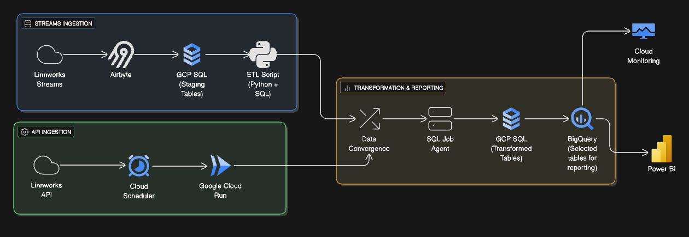

# Linnworks Data Pipeline

  

## Overview
This project delivers an **end-to-end data pipeline** for **ingesting, transforming, and reporting Linnworks data** using Google Cloud Platform.  
It enables a seamless flow of data from Linnworks to **BigQuery** and **Power BI**, ensuring accurate, timely, and actionable insights.

The pipeline is designed for:
- **Automated ingestion** of both real-time streams and API data  
- **Centralized transformation** and convergence in GCP SQL  
- **Scalable analytics** powered by BigQuery and visualized in Power BI  

---

## Architecture
The system follows a modern **ETL** architecture with three primary layers:

1. **Streams Ingestion** – Captures real-time data from Linnworks streams  
2. **API Ingestion** – Collects additional data from Linnworks APIs on a schedule  
3. **Transformation & Reporting** – Merges, transforms, and publishes data for analytics  

---

## Data Flow

### 1. Streams Ingestion
- Real-time data is streamed from **Linnworks Streams** via **Airbyte**.  
- Data lands in **GCP SQL staging tables** for temporary storage.  
- **ETL scripts** (Python + SQL) process and structure the streamed data for integration.  

**Flow:**  
`Linnworks Streams → Airbyte → GCP SQL (Staging Tables) → ETL Script`

---

### 2. API Ingestion
- Batch data is retrieved from the **Linnworks API** using a **Cloud Scheduler**.  
- Scheduler triggers **Google Cloud Run** jobs to extract and prepare data.  
- API data complements streamed data for complete coverage.  

**Flow:**  
`Linnworks API → Cloud Scheduler → Google Cloud Run`

---

### 3. Transformation & Reporting
- Both ingestion sources converge in a **Data Convergence** layer.  
- A **SQL Job Agent** executes scheduled transformations and merges within **GCP SQL (Transformed Tables)**.  
- Selected datasets are published to **BigQuery** for analytics and **Power BI** dashboards.  
- Performance and reliability are tracked via **Cloud Monitoring**.  

**Flow:**  
`Data Convergence → SQL Job Agent → GCP SQL (Transformed Tables) → BigQuery → Power BI`  
`↳ Cloud Monitoring for observability`

---

---

## Linnworks Tables & Streams
The following tables are extracted from Linnworks and processed through Airbyte:

| Table Name                 | Source Stream           |
|-----------------------------|------------------------|
| `Processed_order_details`   | Orders Stream          |
| `Processed_orders`          | Orders Stream          |
| `stock_items`               | Stock Items Stream     |
| `Stock_location_details`    | Stock Locations Stream |
| `Stock_locations`           | Stock Locations Stream |

Additional reference: [Linnworks ERD Diagram](https://docs.linnworks.com/resources/Storage/documentation/Files/LW_Database_structure_image.png)

---

## Project Structure

- **docs/** – Documentation for mapping
- **etl/** – ETL scripts and workflows
- **img/** – Images used in README 
- **logs/** – Execution logs
- **migrations/** – Incremental database changes (versioned)
- **notebooks/** – Jupyter notebooks for exploration and validation
- **schema/** – Base DDL SQL scripts
- **scripts/** – Utility scripts (backup, restore, pipeline run, etc.)
- **src/** – Python ETL source code
- **tests/** – Unit tests and SQL tests
- **README.md** – Project overview and instructions
- **requirements.txt** – Python dependencies

## To-Do

- Document the **column-to-stream mapping** for all denormalized tables.  
- Enhance **data validation tests** for consistency across staging and transformed layers.  
- Follow **Same naming nomenclature**  acroos all tables 
- Maintain **version control** for all schema and migration scripts.  
- Automate Failure Logs to emails
